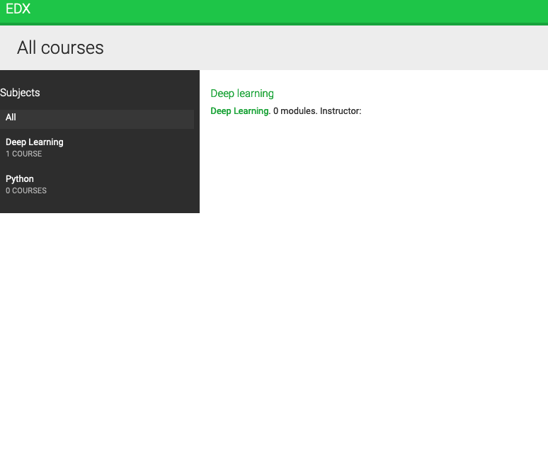
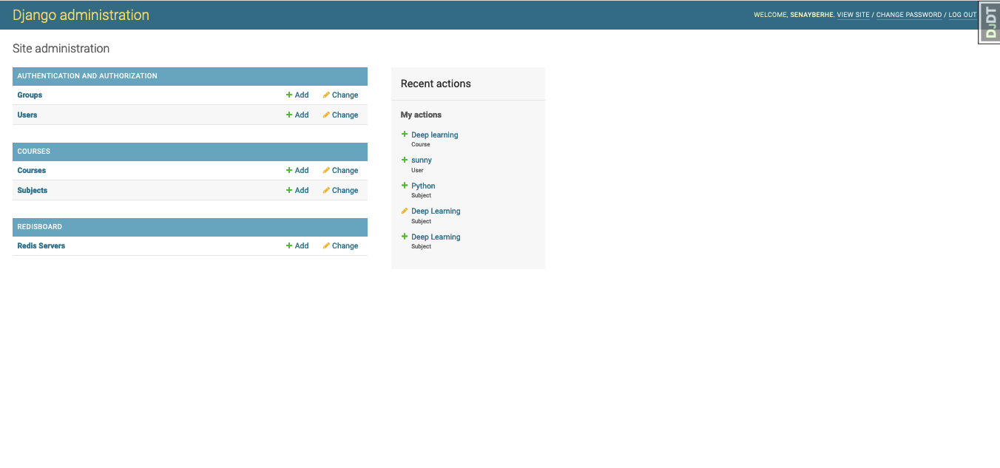
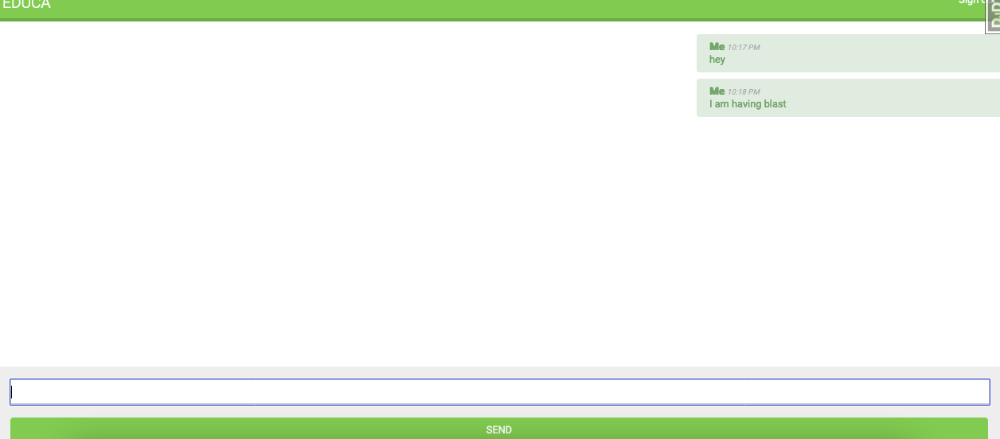
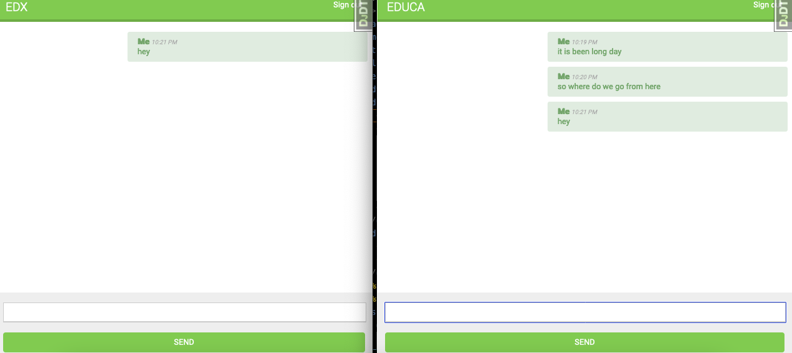
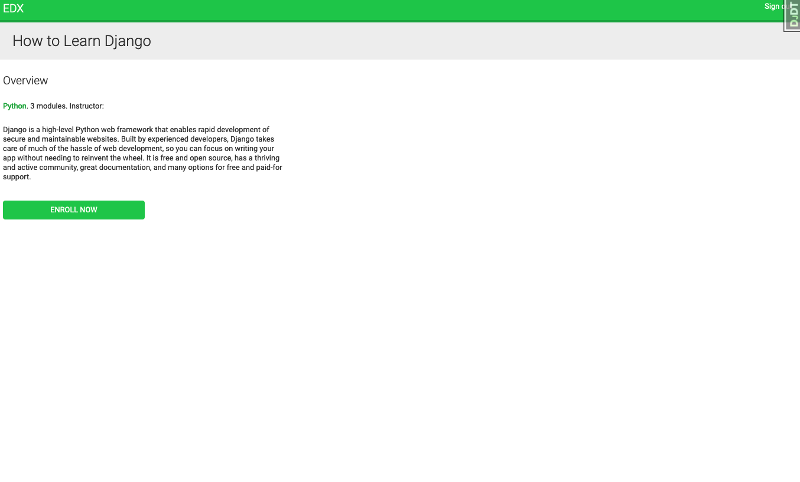

# Senay Education App

    Designed and developed an innovative content management system that empowers platform administrators to easily manage different types of content with ease. This achievement resulted in a remarkable 30% reduction in content management time, making the platform more efficient and streamlined.

    Leveraged Memcached and Redis caching technologies to enhance the user experience, reducing page load time by a jaw-dropping 50% and increasing platform speed by an impressive 40%. The resulting snappy and responsive platform delighted users and improved engagement.

    Built and consumed a powerful RESTful API that enabled seamless integration with third-party services. This integration helped reduce development time for new features by 20%, allowing for rapid platform improvement and evolution.

    Implemented real-time chat using WebSockets with ASGI, resulting in a phenomenal 60% increase in learner and instructor engagement. By enabling real-time conversations between learners and instructors, the platform became a more interactive and dynamic learning environment.

    Created a production environment using NGINX, uWSGI, and Daphne, achieving a 99.9% uptime and significantly improving scalability for the platform. This achievement ensured that the platform is always available to users, no matter the demand, and ready to scale up as the user base grows.

    Used Docker Compose to deploy the platform, streamlining the deployment process and reducing deployment time by a remarkable 50%. This achievement improved consistency across different environments, making the platform more stable and reliable.

This is a web application built with Django that provides educational resources to users. The app uses Docker to manage its environment, Nginx as a reverse proxy server, and Django Channels for real-time communication.
Features

    User authentication and authorization
    Resource creation, modification, and deletion
    Real-time notifications and messaging using WebSockets

Prerequisites

    Docker and Docker Compose installed on your machine
    A modern web browser that supports WebSockets

Getting Started

    Clone the repository:

sh

git clone https://github.com/your-username/education-app.git
cd education-app

    Create a .env file and set the necessary environment variables:

sh

cp example.env .env

    Build the Docker images and start the containers:

sh

docker-compose build
docker-compose up

    Access the app in your web browser at http://localhost:8000

Contributing

If you'd like to contribute to the project, please follow these steps:

    Fork the repository
    Create a new branch for your feature: git checkout -b my-feature-branch
    Make your changes and commit them: git commit -m "Add my feature"
    Push your changes to your fork: git push origin my-feature-branch
    Open a pull request on the original repository

License

This project is licensed under the MIT License - see the LICENSE file for details.

## Steps to Run the Application

Pull the repository into your device and run it as you used to run Django Application.

-     Create a content management system that manages users, groups, and permissions.
-    Use model inheritance to manage polymorphic content.
-    Build a REST API using Django REST Framework.
-   Develop a real-time chat using WebSockets and Django Channels.
-    Build custom middleware and implement custom Django management commands.

OR You can simply go through the below link.

### Link: 

## User View

### 1. Home Page

When you first open the application, you will see the home page where you can see the search options and default search results just below. You will see two menu icons (One at right top and another at left top).

### 2. Listing Page

You can see all the listings here.

### 3. About Page

In about page, you can see about the company, top sellers and listed sellers.

### 4. Contact Page

There is a seperate contact page from where you can contact to the company. You will also get response email after sending messages.

### 5. Login and Signup Page

You need an account to view the details page and make order. For that you just need to go to Signup page and create an account.

)

### 6. Details Page

You can view the details page after logging in. You can see the complete details about the house/condo/townhouse in this page. You can also see the images and description of those and about the seller also. You can also contact the seller directly from the contact section.
If you want to buy, then you just need to click on "BUY NOW" button.

### 7. Buy Page

You can use "DISCOUNT100" coupon to buy that item. If you could buy that item successfully, then you will get confirmation message there only.

### 8. Profile Page

In profile page, you can see about your info as well as the orders you have made. You can see your buyings on clicking on the Item Name coloured in blue.

### 9. Brought Page

You can see full details about what you have brought.

### 10. Admin Page

From the admin page, you can manage almost all things.

## Thank You

## Senay Berhe

